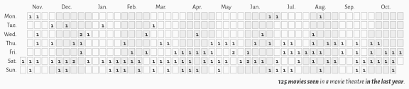
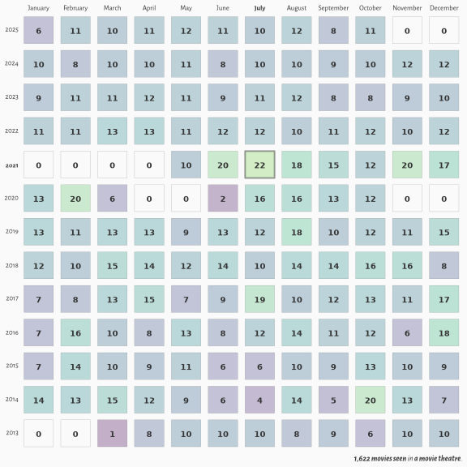
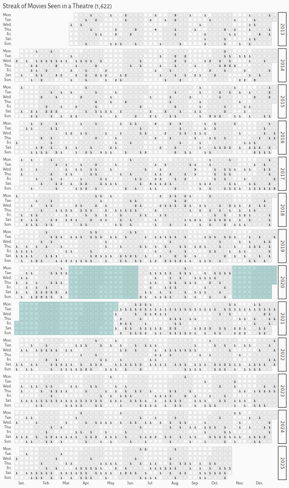

# My IMDb Ratings Analysis

<!-- badges: start -->

<!-- badges: end -->

<picture>
  <source media="(prefers-color-scheme: dark)" srcset="media/streak-dark.svg">
  <source media="(prefers-color-scheme: light)" srcset="media/streak-light.svg">
  
</picture>

<picture>
  <source media="(prefers-color-scheme: dark)" srcset="media/counts-dark.svg">
  <source media="(prefers-color-scheme: light)" srcset="media/counts-light.svg">
  
</picture>

<picture>
  <source media="(prefers-color-scheme: dark)" srcset="media/streak-years-dark.svg">
  <source media="(prefers-color-scheme: light)" srcset="media/streak-years-light.svg">
  
</picture>
